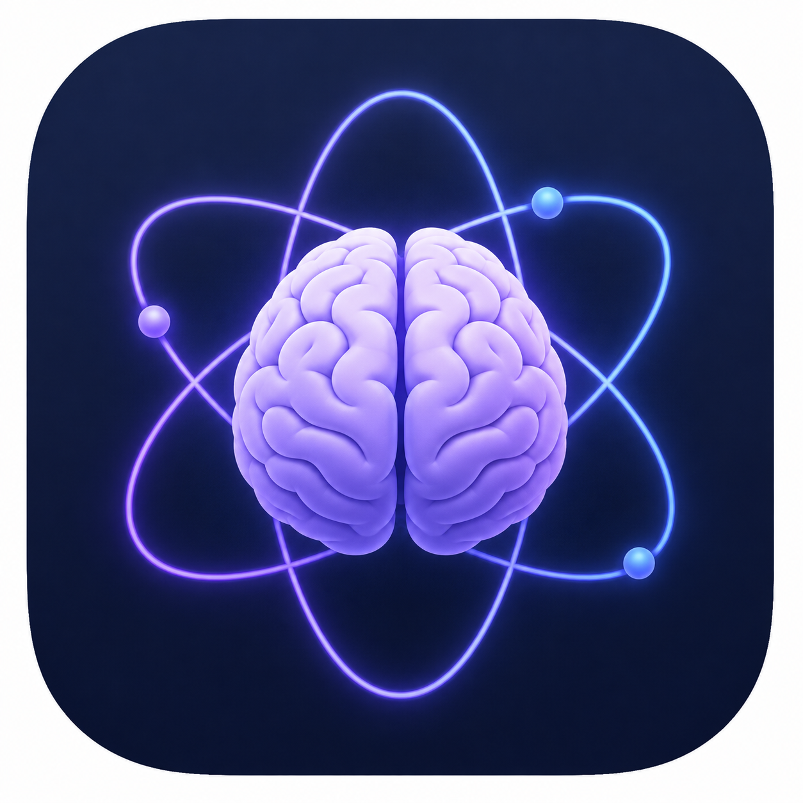

# Neurohelp

### Eine App, die im Alltag hilft, ohne Druck zu machen

Für Menschen, denen Dinge schwerfallen, 
die für andere selbstverständlich sind.

 

<!-- STORE-KNOEPFE
     Solange die App in keinem Store liegt, steht hier der APK-Knopf. Sobald
     Play Store und App Store live sind, die beiden Zeilen darunter
     einkommentieren, den APK-Knopf entfernen und die zwei URLs setzen.
     Checkliste dazu: docs/STORE.md -->

<!--

-->

 

> Manche Dinge sind objektiv klein und fühlen sich trotzdem unmöglich an.
> Beim Amt anrufen. Eine Mail schreiben, die seit drei Wochen offen ist.
> Eine Aufgabe anfangen, die eigentlich aus zwölf kleinen Aufgaben besteht.
>
> **Neurohelp nimmt einem das nicht ab.** Es zerlegt es in Schritte, die
> einzeln machbar sind – und bleibt dabei ruhig.

 

**[Was sie kann](#was-sie-kann)** ·
**[Für wen](#für-wen)** ·
**[Deine Daten](#wo-deine-daten-liegen)** ·
**[Herunterladen](#herunterladen)** ·
**[Technik](docs/TECHNIK.md)**

---

## Was sie kann

<table>
<tr>
<td width="50%" valign="top">

### Aufgabe sortieren

Ein großer Berg wird zu einer Liste kleiner Schritte.

Im Fokus-Modus siehst du immer nur **den nächsten**. Der Rest bleibt
unsichtbar, bis er dran ist.

</td>
<td width="50%" valign="top">

### Nachricht schreiben

Du sagst, worum es geht. Die App formuliert daraus eine Nachricht, die man so
abschicken kann.

Der höfliche Rahmen kommt automatisch – kein Grübeln über Formulierungen.

</td>
</tr>
<tr>
<td width="50%" valign="top">

### Anruf erledigen

Vorher: Was ist das Ziel, wen erreiche ich, was muss gesagt werden.

Währenddessen stehen die Stichpunkte groß auf dem Bildschirm.

</td>
<td width="50%" valign="top">

### Termin klären

Telefon, Mail oder Formular – die App schlägt den Weg vor und führt hindurch.

Danach erinnert sie an Bestätigung, Vorbereitung und Anfahrt. Jede Erinnerung
kommt genau einmal.

</td>
</tr>
</table>

---

## Wie sie sich anfühlt

Das ist bei dieser App wichtiger als jede Funktion.

|  |  |
|:--|:--|
| **Kein Zwang** | Keine Streaks, keine Punkte, keine Abzeichen |
| **Keine Schuld** | Nichts wird rot. Nichts sagt dir, dass du etwas verpasst hast |
| **Kein Lob** | Erledigt ist erledigt. Kein „Gut gemacht!" |
| **Ein Schritt** | Ein Bildschirm, eine Entscheidung. Nie eine Wand aus Optionen |
| **Kein leeres Feld** | Die App fragt nie „Was möchtest du tun?", ohne selbst anzufangen |

Erinnerungen kommen höchstens dreimal. Danach bleibt ein Vorgang still liegen,
ohne Vorwurf.

---

## Für wen

Für Menschen mit ADHS, Autismus, Depression, Angststörung – oder einfach an
einem Punkt, an dem der Alltag zu viel ist.

**Du brauchst keine Diagnose.** Wenn dir das oben bekannt vorkommt, ist die
App für dich.

---

## Wo deine Daten liegen

### Auf deinem Gerät. Nicht in einer Cloud.

Aufgaben, Nachrichten, Anrufe, Termine, deine ganze Historie – alles bleibt
lokal in einer Datenbank auf dem Handy.

Zum Server geht nur:

- **dein Konto** – damit du dich bei einem Gerätewechsel wieder anmelden kannst
- **Reset-Mails**, wenn du das Passwort vergisst
- **der Text für die KI** – und auch das nur, wenn du KI eingeschaltet hast

**KI ist freiwillig.** Beim ersten Start wirst du gefragt, und die Frage hat
zwei gleichwertige Antworten. Ohne KI funktioniert die App vollständig – sie
formuliert dann nur nicht selbst.

---

## Herunterladen

> [!WARNING]
> **Das ist eine Alpha.** Zum Ausprobieren, nicht für den täglichen Gebrauch.
> Daten liegen lokal und sind bei einer Neuinstallation weg.

| | Datei | Hinweis |
|:--|:--|:--|
| **Android** | [**APK herunterladen**](https://github.com/Phydran6/Neurohelp/releases/download/v0.1.0-alpha.5/Neurohelp-0.1.0-alpha.5-android.apk) | Antippen, installieren, fertig |
| **iOS** | über **TestFlight** – Einladung auf Anfrage | Das IPA im Release ist ein App-Store-Build und lässt sich nicht sideloaden |
| **Play Store** | [AAB](https://github.com/Phydran6/Neurohelp/releases/download/v0.1.0-alpha.5/Neurohelp-0.1.0-alpha.5-android-playstore.aab) | Nur zum Hochladen in die Play Console |
| **Alle Versionen** | [Release-Übersicht](https://github.com/Phydran6/Neurohelp/releases) | Ältere Stände |
| **Was ist neu** | [CHANGELOG.md](CHANGELOG.md) | Jede Änderung, nachvollziehbar |

<!-- Sobald die Stores live sind, ersetzt diese Tabelle die obige:
| | Wo | Hinweis |
|:--|:--|:--|
| **Android** | [Google Play](https://play.google.com/store/apps/details?id=will.neurohelp.help) | |
| **iOS** | [App Store](https://apps.apple.com/de/app/neurohelp/idAPP_ID_EINSETZEN) | ab iOS 13 |
-->

**Deine Daten:** [Datenschutzerklärung](docs/DATENSCHUTZ.md)

**Android:** Beim ersten Mal fragt das Handy, ob Installationen aus dieser
Quelle erlaubt sind. Das ist normal bei Apps außerhalb des Play Stores.

**iOS:** Apple erlaubt keine Installation aus dem Browser. Der Weg läuft über
TestFlight – schreib ins [Issue-Formular](https://github.com/Phydran6/Neurohelp/issues),
wenn du testen willst.

---

## Mitmachen

Rückmeldungen sind willkommen – besonders, wenn sich etwas nach Druck anfühlt.
Genau das soll die App nicht.

[Fehler melden](https://github.com/Phydran6/Neurohelp/issues) ·
[Beitragsleitfaden](.github/CONTRIBUTING.md) ·
[Konzept](docs/KONZEPT.md)

 

### [→ Technische Dokumentation](docs/TECHNIK.md)

Aufbau, Entwicklung, Backend, Release-Prozess

  

[MIT-Lizenz](LICENSE) · © 2026 Philipp Fischer

